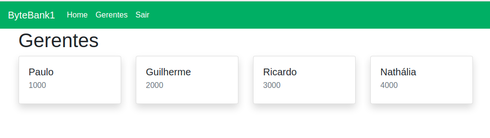

# Treinamento da Alura sobre Vuex.

````
Nesse treinamento desenvolvi um sistema de login por token, 
nele mostrando como salvar o token na sessão e na store do Vuex.
Existem 2 projetos nesse treinamento, web (Frontend) e server (Backend).
````




## Coisas que aprendi nesse treinamento.

````
Vuex: Lib para controlar o estado da aplicação.
Padrão de gerenciamento de estado. View -> Action -> Mutation -> State
State       <- Estado da aplicação.
Mutations   <- Altera o estado.
Actions     <- Ação que executa alguma coisa e chama a mutation.
Getters     <- Lê as informações do State.
Mixins      <- Actions mais utiliuzadas, como por exemplo logout.

Interceptors através do axios.

Verificar o token antes de construir o componente no router.

Importar somente o componente que irá utilizar no router.
````